# [Todo List App](https://todo-list-django-project-6e09443cb165.herokuapp.com/ "Take you to the Todo List Deployed Page")

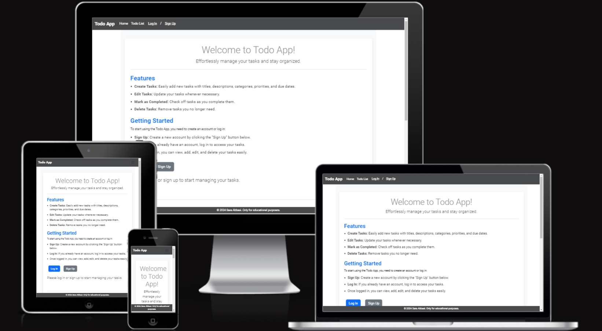

# Introduction

Welcome to the Todo List Django project! This project aims to provide a simple and effective way to manage your tasks and stay organized.
Built using Django, this application provides a user-friendly interface where you can easily create, update, and track your tasks with ease.

[Live Site Here](https://todo-list-django-project-6e09443cb165.herokuapp.com/ "Take you to the Todo List Deployed Page")

# Table of Contents

- [Key Project Goals](#key-project-goals)
- [Agile Development](#agile-development)
- [User Stories](#user-stories)
- [User Experience](#user-experience)
    - [Wireframes](#wireframes)
    - [Database Schema](#database-schema)
    - [Typography](#typography)
    - [Colour Palette](#colour-palette)
- [Features](#features)
    - [Existing Features](#existing-features)
        - [Non logged in user](#non-logged-in-user)
            - [The Landing page And General Site Content](#the-landing-page-and-general-site-content)
            - [Login](#login)
            - [Sign Up](#sign-up)
        - [Logged in User](#logged-in-user)
            - [Todo list](#todo-list)
        - [Staff User](#staff-user)
            - [Add new task](#add-new-task)
            - [Edit Page](#edit-page)
            - [Delete Page](#delete-page)
    - [Future Features](#future-features)
- [Technologies Used](#technologies-used)
- [Testing](#testing)
- [Deployment](#deployment)
    - [Deploying on GitHub Pages](#deploying-on-github-pages)
    - [The ElephantSQL Database](#the-elephantsql-database)
- [Credits](#credits)
    - [Content](#content)
        - [Images](#images)
    - [Education](#education)
- [Acknowledgements](#acknoledgements)

[Back to Top](#todo-list-app)

# Key Project Goals

The goals of the site functionality are:

- List View: Users can see all the public tasks, even if they have not registered or logged in.
- Register: Users can sign up on the site to unlock its full functionality, including the ability to add private tasks that remain hidden from others. 
- Logged In: Users can access their all tasks only after authentication, enhancing privacy and data security.
- User login: Users can add tasks with titles, descriptions, categories, priorities, and due dates. They can also edit existing tasks and mark tasks as completed when finished.
- Admin: can create new staff users.

# Agile Development

A Kaban board was used in GitHub to create the agile development process – see the board [here]( https://github.com/users/SaraabbasiNZ/projects/4 "Kaban board for Todo List Project")

User stories were labelled using the MoSCoW method.

[Back to Top](#todo-list-app)

# User Stories

3 Epics were created broken down into user stories, the epics included:

1. Admin
2. Site Access
3. User Functions

The user stories are as follows:

## Epic - Admin

### Create Users

- As an admin, I can use the Django admin panel to create new users so that they can create new tasks
    - AC1 - Admin can access the Django admin panel
    - AC2 - Admin can create users in the Django admin panel
    - AC3 - New users can create, read, edit and delete tasks

Tasks 
- Create users
- Ensure new members can create, read, edit and delete tasks

## Epic - Site Access

### Log-in and Log-out

- As a site user, I can log in with my created username and password to access the site and see my previous actions
    - AC1 - Site users can log in with their created username and password after they have registered to the site
    - AC2 - Site users can see the tasks they have created from a previous login
    - AC3 - Site users can log out whenever they want

Tasks
- Link accounts/login template so that users can sign into the site
- Link accounts/logout template so that users can sign out of the site
- Ensure data is saved from previous login so that users can see their previous tasks

### Register an account

- As a site user I can register an account so that I can log in and access the site's homepage and create tasks
    - AC1 - User can register account and see site functionality

Tasks
- Create a Register nav link button
- Link 'accounts/signup.html' template so that new users can register to the site
- Ensure registered users can see site functionality changed from being logged in vs logged out

## Epic - User Functions

### View Todo list

- As a site user I can view the public tasks added by other users so that I can decided if I wish to sign up to create my own tasks
    - AC1 - When the site loads, the list of public tasks are visible to the user both logged and not logged in.
    - AC2 - User can view todo app instruction without logged in
    - AC3 - Users can create task once they logged in

Tasks
- Create a todo model to pull data from added tasks and view to show the public tasks on the homepage
- Create user authentication so that only logged-in users can create tasks

### Create a task

- As a logged-in site user, I can navigate to my todo list so that I can easily add new tasks by clicking on "Add new task," which directs me to the task creation page
    - AC1 - The site user must log in to access the site. Only logged-in users can see the "Add new task" button and utilize its functionality
    - AC2 - Clicking the "Add new task" button directs users to a creation page where they can add tasks along with various customizable options
    - AC3 - Users have the ability to cancel task creation if they change their mind

Tasks
- Ensure the 'Add new task' button is not visible to unauthorised users
- Create model and view all tasks once user logged in
- Create cancel button which removes task creation page and return to todo list

## Future Stories

Future user stories were also created for the following:

- As a user, I want to customize my profile settings such as avatar, display name, and notification preferences so that I can personalize my experience on the Todo List app
- As a user, I want to receive reminders and notifications for upcoming tasks based on due dates and priorities so that I can stay organized and manage my time effectively
- As a user, I want to share and collaborate on tasks with other registered users or team members so that we can work together efficiently and achieve shared goals

# User Experience

## Wireframes

Included wireframe designs for the home page and todo list page to visualize the layout and structure of the application interface.

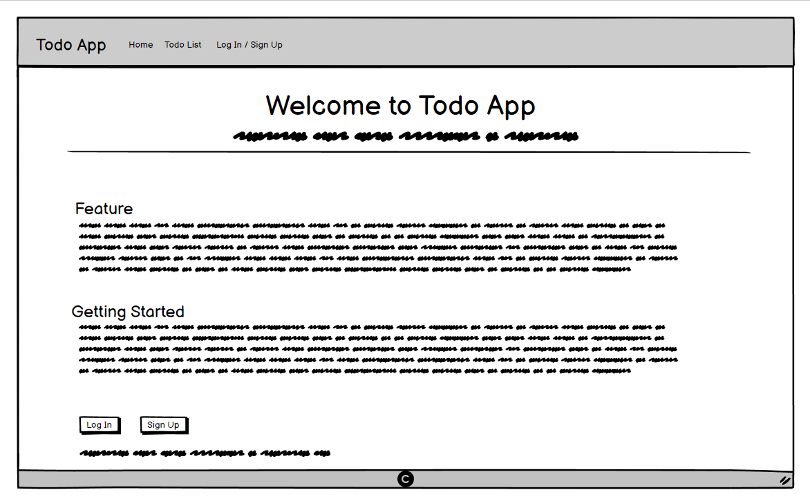

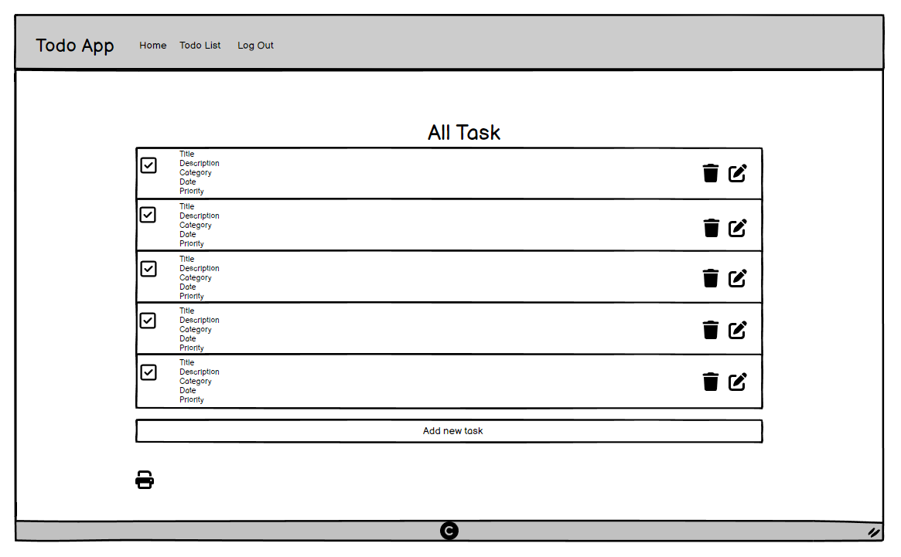

## Database Schema

This project employs a structured database schema to manage Todo items efficiently. The schema includes four main tables: User, Category, Priority, and TodoItem.

The data schema was designed with [Lucidchart](https://www.lucidchart.com/ "Lucidchart website homepage") as the project progressed, helping us map out how users, categories, priorities, and Todo items are organized and interact within the application. This visualization tool ensured we could plan and understand the relationships and functionalities of our database models effectively. 
 

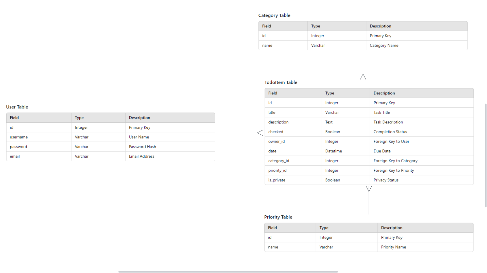

## Typography

The google font [Roboto](https://fonts.google.com/specimen/Roboto/ "Roboto font") was used throughout the site with different weights for different headings and paragraphs.

Roboto was chosen for its clear readability, modern design, and versatile adaptability across different screen sizes and devices. It enhances user experience by ensuring content is easily readable and visually appealing throughout the project.  

## Colour Palette

In this ToDo list project, a carefully chosen color palette enhances the user experience and readability. Dark Gray, Light Gray, and Medium Gray provide a neutral, professional backdrop, while White ensures high contrast and clarity. Accents of Blue, Amber, and Green highlight important elements and statuses, creating a visually appealing and functional interface. 

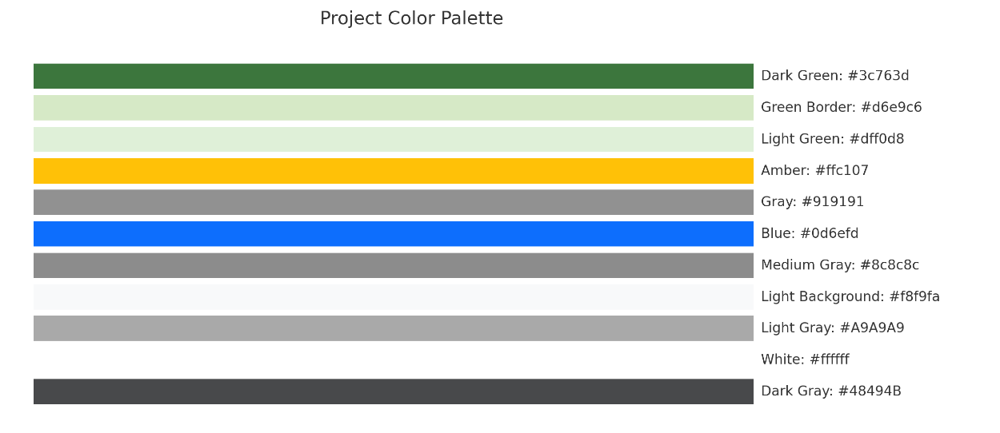

[Back to Top](#todo-list-app)

# Features

## Existing Features

## Non-Logged in User

### The Landing page And General Site Content

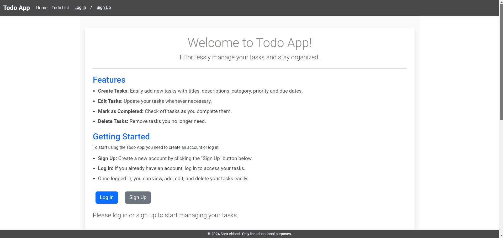
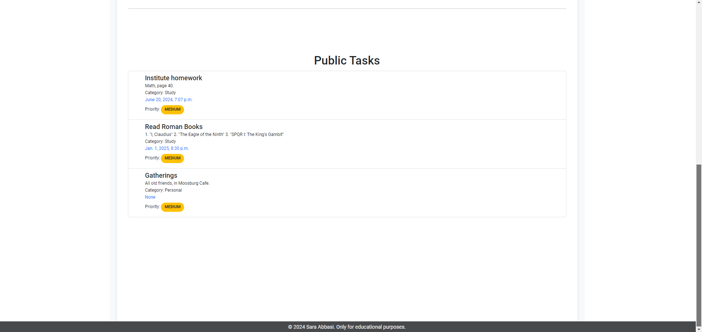

The landing page provides non-logged-in/non-registered users with instructions, public tasks, and an explanation of how they can create tasks. It effectively communicates the site's offerings and guides users on their next steps.

Additionally, the landing page features two primary calls to action: Signup and Login. It is designed to be responsive across various screen sizes, ensuring optimal usability on mobile devices and tablets. 

### Login

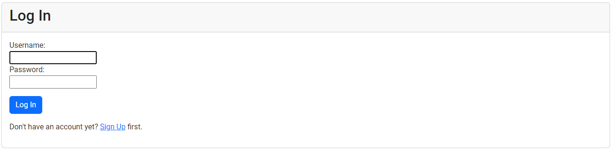

The login page prominently features two options: username and password. The design is user-friendly and approachable, incorporating rounded corners on the input boxes.

At the bottom of the login section, there is a sign-up link for users who do not yet have an account.

If incorrect credentials are entered, an error message will display: "Please enter a correct username and password. Note that both fields may be case-sensitive."

### Sign Up

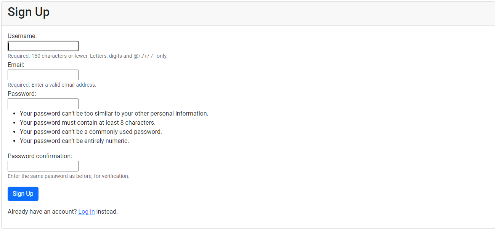

The Sign Up process informs users that they need to register an account to access site functions.

It provides fields for entering a username, password, and prompts users to re-enter their password to confirm it matches without errors.

If a username is already taken, an error message will indicate: "A user with that username already exists." If the passwords entered do not match, the error message will state: "The two password fields didn’t match."

The Sign Up form includes clear guidelines on creating a password, emphasizing that a username and email address are required fields.

## Logged in User

### Home Page

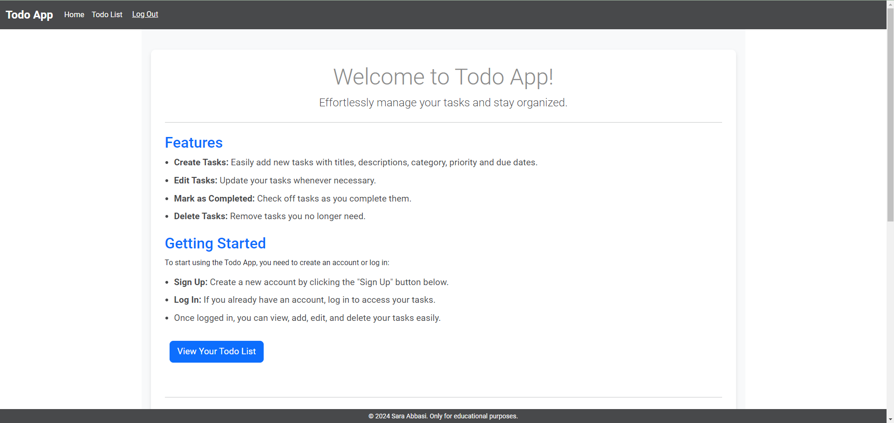

After logging in, the user will immediately notice a new button labeled "View Your Todo List". This button allows users to access their todo list and create tasks.

### Todo List

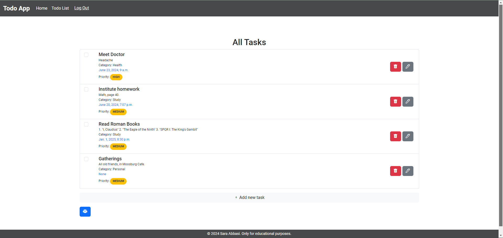

In your todo list, you will find an "Add New Task" button. Clicking this button takes you to the task creation page. Once a task is created, you will have full CRUD functionality available for your task. This means you can read, edit, update, and delete your task as needed.

Additionally, there is a print button available for users who wish to print their tasks. Clicking the print icon directs them to a printable version of their tasks.

## Staff User

### Add new task

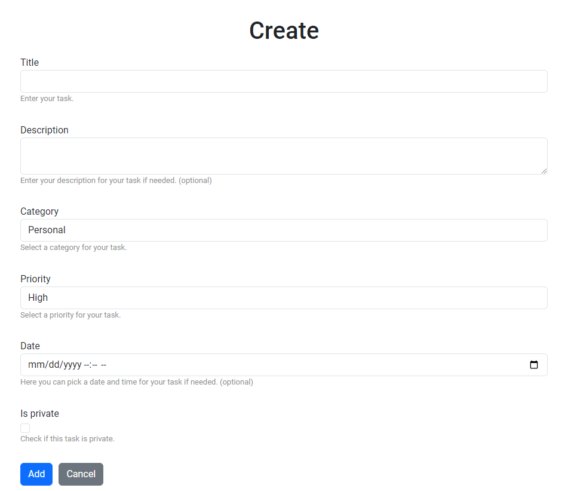

The task creation page allows users to add new tasks to their todo list. Users can enter a title and description if needed.

The form includes warnings for both the date and time fields if they are not entered correctly. To ensure correct date formatting, the placeholder text 'YYYY-MM-DD'00:00' has been added.

Users are required to select a category from the available options; if none fit, they can choose "Other."

Users can also assign priority levels to their tasks: High, Medium, or Low.

Lastly, there is a checkbox field to indicate whether the task is private. Private tasks are only visible to the user in their todo list and are not accessible to unauthorized users. If the private checkbox is not selected, the task will be added as public, visible to all users.

## Edit Page

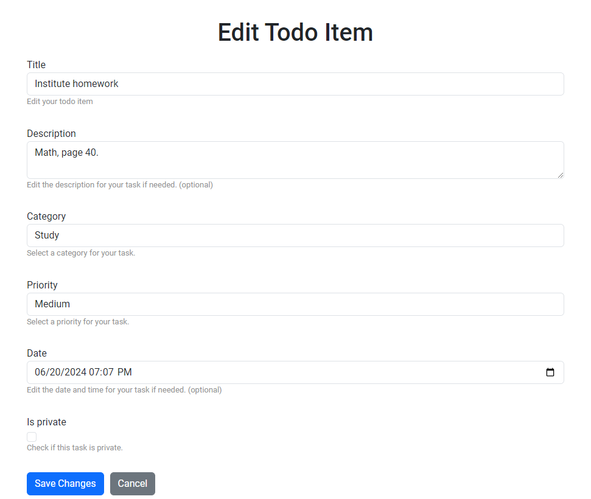

The edit page appears when a task has already been added. Clicking the edit button displays the edit page, which contains the same fields as the create page. However, the edit form is pre-populated with the existing task details.

Similarly, error messages will be displayed if incorrect information is entered, ensuring data integrity.

## Delete Page

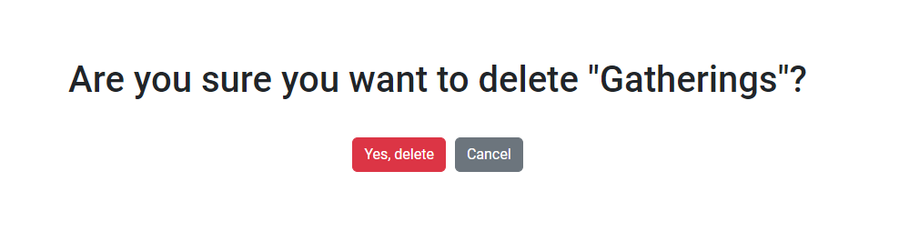

When clicking the delete button, the user is prompted to confirm whether they are sure they want to delete the task before the action is executed.

## Future Features

There are some future features that I would like to add to the project to improve user functions.

- Real-time Collaboration:
Add features like task comments, activity logs, and live notifications for changes.

- User Profile Customization:
Allow users to create and edit their profile with information like a profile picture, bio, and contact details.

- Customizable Notification:
Allow users to customize their notification preferences, such as choosing which types of notifications to receive (e.g., task due dates, reminders, collaboration updates).

[Back to Top](#todo-list-app)

# Technologies Used

- [Lucidchart](https://www.lucidchart.com/ "link to Lucidchart homepage")
Lucidchart was used to create the Database Schema in the developing stages of the project
- [HTML5](https://en.wikipedia.org/wiki/HTML5 "link to html5 wikipedia")
Used to create structure and content for the site.
- [CSS](https://www.w3.org/Style/CSS/Overview.en.html "link to w3")
Used to add custom styles to the site.
- [Django](https://www.djangoproject.com/ "link to django docs homepage")
The python framework used to develop the site.
- [Bootstrap](https://getbootstrap.com/ "link to bootstrap homepage")
The CSS framework used to add styles and structure to the site.
- [Python](https://en.wikipedia.org/wiki/Python_(programming_language) "link to Python wikipedia")
Used to provide functionality to the site.
- [Cloudinary](https://cloudinary.com/ "link to cloudinary homepage")
Used to host images and static files 
- [ElephantSQL](https://www.elephantsql.com/ "link to elephantsql homepage")
Used to host the database used for the site.
- [Am I Responsive?](https://ui.dev/amiresponsive "Link to Am I responsive webpage")
Am I Responsive was used to see the responsive design and create screenshots of the final page on different devices.
- [Gitpod](https://www.gitpod.io/#get-started "Link to gitpod webpage")
Used to create code and file structure for the respository.
- [GitHub](https://github.com/ "Link to github webpage")
GitHub was used to store the code files, README files and asset files after pushing
- [Heroku](https://id.heroku.com/login "Link to Heroku login")
Heroku was used to deploy the project. 

# Testing

Testing detail can be found [here](TESTING.md)

# Deployment

The project is deployed to GitHub via Gitpod Terminal. Then it is connected to the Heroku app to be reached via a web browser for user convenience. To enable this, a special Code Institute template was cloned and used [Code institute template](https://github.com/Code-Institute-Org/python-essentials-template).

## Cloning The Repository

To clone the repository using GitHub the following steps were taken:

1. In the repository, select the "code" tab.
2. Select "HTTPS" in the dropdown menu.
3. Click the 'copy URL to dashboard button.
4. Open your chosen IDE
5. Create a new workspace and paste in the copied URL
6. Press enter

## Deploying on GitHub Pages

To deploy this page to Heroku from its Codeanywher repository, the following steps were taken:

1. Get Python Essentials Template from Code Institute [P3 Template](https://github.com/Code-Institute-Org/p3-template "p3 template link")
2. Create a new repository using the P3 template
3. Copy the repo URL and copy it into Gitpod to create a new workspace
4. Install Django - add to requirements file
5. Create Procfile and add guricorn
6. Log in to Heroku
7. Click 'New' - 'Create new app'
8. Enter a name for the application and select the region
9. Click 'Create App'
10. Go to Settings and connect to GitHub - choose the correct repository
11. Click 'Reveal config vars' and add DISABLE_COLLECTSTATIC as the key with a value of 1
12. Go to Deploy and scroll down, click on 'Deploy Branch' to manually deploy
13. Once the app has deployed, click 'Open App' at the top of the page

## The ElephantSQL Database
ElephantSQL PostgreSQL Database was used for this project, to set up a database the following steps were taken:

1. Sign up or log in to ElephantSQL with your GitHub account.
2. Click on "Create New Instance".
3. Enter a name for the instance
4. Select "Tiny Turtle (Free)" free plan.
5. Click "Select Region".
6. Select a data centre near you.
7. Click "Review".
8. Ensure that all details are correct and then click "Create instance".
9. Copy the database URL
10. Add the database into the setting.py file

You will also need to add the database to your Django settings.py file:

DATABASES = {

'default': dj_database_url.parse(os.environ.get("DATABASE_URL"))

}

[Back to Top](#todo-list-app)

# Credits

## Education

- [Making queries](https://docs.djangoproject.com/en/5.0/topics/db/queries/ 'django documention for making queries')

- [Django Validators](https://studygyaan.com/django/how-to-implement-validators-in-django-models?utm_content=cmp-true 'how to use django validators')

- [Date fields and timezones in Django](https://docs.djangoproject.com/en/5.0/topics/i18n/timezones/ 'django documentation on timezones')

- [User.is_authenticated](https://docs.djangoproject.com/en/5.0/ref/contrib/auth/ 'django documentation on django.contrib.auth')

- [Date Picker](https://www.letscodemore.com/blog/how-to-add-date-input-widget-in-django-forms/#:~:text=In%20this%20case%2C%20we%20are,is%20rendered%20in%20the%20template. 'letscodemore date widget page')

- [Creating a Django Todo List App (Part 1)](https://www.youtube.com/watch?v=cDJ3WE8ldzY "link to YouTube tutorial")

- [Build a Django Todo List App with User Authentication](https://www.youtube.com/watch?v=llbtoQTt4qw "link to YouTube tutorial")

- [Django todo list](https://www.youtube.com/watch?v=vVUFjTBflwU&list=PLeG3OyDnNf9astxYQX3knhTISA0qr9W_5 "link to Youtube tutorial")

- [ChatGPT](https://openai.com/blog/chatgpt "link to chatgpt page")

# Acknowledgements

- Special thanks to my mentor, Antonio Rodriguez, for his invaluable help, support, and the wealth of resources he generously shared. His friendly guidance was instrumental—I couldn't have completed this project without him!
- Friends and family who helped test the site on different devices and give real world user feedback.

[Back to Top](#todo-list-app) swim