# Todo List App Testing

Return to [README.md](README.md)

# Table of Contents

- [Code Validation](#code-validation)
    - [W3C HTML Validation Results](#w3c-html-validation-results)
    - [W3C CSS Validation Results](#w3c-css-validation-results)
    - [JSHint Validation Results](#jshint-validation-results)
    - [CI Python Linter Validation Results](#ci-python-linter-validation-results)
- [Manual Testing](#manaul-testing)
    - [Register Page](#register-page)
    - [Login Page](#login-page)
    - [Home Page](#home-page)
    - [Add Task](#add-task)
    - [Edit Task](#edit-task)
    - [Delete Task](#delete-task)
    - [Logout](#logout)
    - [Other Testing](#other-testing)
    - [Responsiveness testing](#responsivness-testing)
- [Browser Compatibility](#browser-compatibility)
- [User Testing](#user-testing)
- [Accessibility Testing](#accessibility-testing)
- [Known Bugs](#known-bugs)

# Code Validation 

## W3C HTML Validation Results

All HTML code has been run through the [W3C HTML Validator](https://validator.w3.org/).

 W3C HTML Errors Found and fixed

signup.html

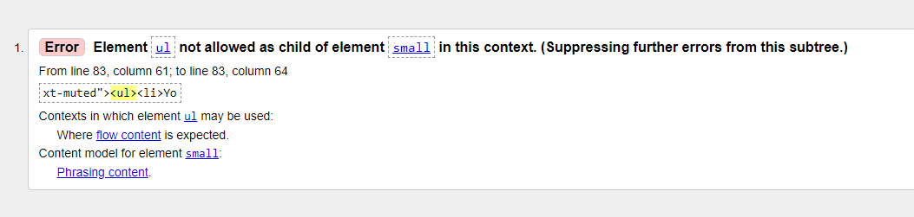

After testing, all errors were fixed, and the document checking process confirmed completion for all pages.

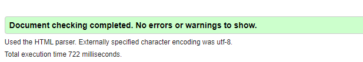

| **SOURCE CODE TEMPLATE** | **RUN THROUGH VALIDATOR** | **ANY ERRORS** | **ERRORS RESOLVED** |
| -------- | ---------- | --------------- | -----------|
| home.html | Yes | No | N/A |
| todo_list.html | Yes | No | N/A |
| edit_todo_item.html | Yes | No | N/A |
| confirm_delete.html | Yes | No | N/A |
| create_todo_item.html| Yes | No | N/A |
| signup.html | Yes | Yes - detailed image above | Yes, retested and all passed |
| login.html | Yes | No | N/A |

## W3C CSS Validation Results

All custom CSS has been run through the [W3C CSS Validator](https://jigsaw.w3.org/css-validator/ "jigsaw w3 page")

No errors were found when running CSS through w3c validator

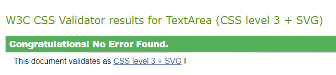

## JSHint Validation Results

No javascript warning.

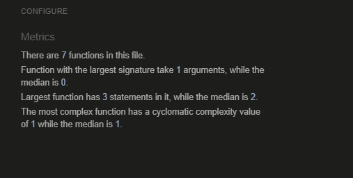

## CI Python Linter Validation Results

All python code that was written for this project was developed following PEP8 guidelines and was run through the [CI Python Linter](https://pep8ci.herokuapp.com/ "ci python linter page")

| **Python file** | **RUN THROUGH VALIDATOR** | **ANY ERRORS** | **ERRORS RESOLVED** |
| -------- | ---------- | --------------- | -----------|
| views.py | Yes | All clear, no errors found | N/A |
| urls.py | Yes | All clear, no errors found | N/A |
| models.py | Yes | All clear, no errors found | N/A |
| forms.py | Yes | All clear, no errors found | N/A |
| admin.py | Yes | All clear, no errors found | N/A |
| settings.py | Yes | All clear, no errors found | N/A |

Final testing showed:

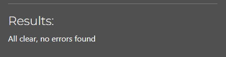

# Manual Testing

## Register Page

| **TEST** | **ACTION** | **EXPECTATION** | **RESULT** | **FIX** |
| -------- | ---------- | --------------- | -----------| ------- |
| Registration Form | Clicked on "Sign Up" nav link | Register form is displaying | Worked as expected | N/A |
| Username | Typed in @£$%^ as username | Warning will show. Warning showed 'Enter a valid username'. This value may contain only letters, numbers, and @/./+/-/_ characters. | Worked as expected | N/A |
| Username | Typed in admin as username | Warning will show. Warning showed 'A user with that username already exists.' | Worked as expected | N/A |
| Password 1 | Typed in password same as username | Warning will show. Warning showed 'The password is too similar to the username.' | Worked as expected | N/A |
| Password 2 | Typed in password different to password1 | Warning will show. Warning showed 'You must type the same password each time.' | Worked as expected | N/A |
| Register Button | Click "Sign Up" | Button takes user to logged in dashboard on home page | Worked as expected | N/A |

## Login Page

| **TEST** | **ACTION** | **EXPECTATION** | **RESULT** | **FIX** |
| -------- | ---------- | --------------- | -----------| ------- |
| Username | Typed in random username | Warning will show. Warned showed 'The username and/or password are invalid.' | Worked as expected | N/A |
| Password | Typed in incorrect password | Warning will show. Warned showed 'The username and/or password are not valid.' | Worked as expected | N/A |
| Log In | Typed in correct username and password, pressed "Log In" | Button takes user to logged in dashboard on home page | Worked as expected | N/A |
| Sign Up | Clicked on Sign Up link | Get taken to register page | Worked as expected | N/A |

## Home page

| **TEST** | **ACTION** | **EXPECTATION** | **RESULT** | **FIX** |
| -------- | ---------- | --------------- | -----------| ------- |
| Nav Links | Opened site url | Only sign up and log in nav links are visible and required | Worked as expected | N/A |
| "View Your Todo List" Button | Clicked the button | List of the tasks appear | Worked as expected | N/A |
| Instruction and Public Tasks | The instruction and only public tasks created by all users | Instruction and public tasks appear | Worked as expected | N/A |

## Add Task

| **TEST** | **ACTION** | **EXPECTATION** | **RESULT** | **FIX** |
| -------- | ---------- | --------------- | -----------| ------- |
| Add task | Clicked "Add new task" | Create task form showed | Worked as expected | N/A |
| Title | Tried to type unending title  | Form stops user from typing further | Worked as expected | N/A |
| Description | Tried to type more than 250 characters | Form stops typing further | Worked as expected | N/A |
| Date | Tried to input wrong date format | Date picker stops form with error message | Worked as expected | N/A |
| Time | Tried to input 20.20 as time | Unable to enter invalid time | Worked as expected | N/A |
| Submit | Clicked "Add" button | Form to be submitted and task created | Worked as expected | N/A |

## Edit Task

| **TEST** | **ACTION** | **EXPECTATION** | **RESULT** | **FIX** |
| -------- | ---------- | --------------- | -----------| ------- |
| Data prefilled | Clicked Edit task button | Data form task is prefilled | Worked as expected | N/A |
| Title | Tried to type unending title  | Form stops user from typing further | Worked as expected | N/A |
| Description | Tried to type more than 250 characters | Form stops typing further | Worked as expected | N/A |
| Date | Tried to input wrong date format | Date picker stops form with error message | Worked as expected | N/A |
| Time | Tried to input 20.20 as time | Unable to enter invalid time | Worked as expected | N/A |
| Submit | Clicked "Save changes" | New updates show on todo list | Worked as expected | N/A |

## Delete Task

| **TEST** | **ACTION** | **EXPECTATION** | **RESULT** | **FIX** |
| -------- | ---------- | --------------- | -----------| ------- |
| Delete task | Clicked the "Delete task" button on the todo list | Confirmation message shows asking if task should be deleted | Worked as expected | N/A |
| Delete task on delete page | Clicked "Delete" | Task is removed from the todo list and user receives a success deletion message | Worked as expected | N/A |

## Logout

| **TEST** | **ACTION** | **EXPECTATION** | **RESULT** | **FIX** |
| -------- | ---------- | --------------- | -----------| ------- |
| Logout | Clicked "Log Out" from navbar | redirect to home page for sign up or log in | Worked as expected | N/A |

## Other Testing

| **TEST** | **ACTION** | **EXPECTATION** | **RESULT** | **FIX** |
| -------- | ---------- | --------------- | -----------| ------- |
| 404 Error | Typed /add task at end of url | 404 error page to show | Worked as expected | N/A |

## Responsiveness testing

| **DEVICE** | **ACTION** | **EXPECTATION** | **RESULT** | **FIX** |
| -------- | ---------- | --------------- | -----------| ------- |
| Samsung 20 Ultra | Tested site on mobile | Site functions and is responsive | Worked as expected | N/A |
| iPhone 14 Pro Max | Tested site on mobile | Site functions and is responsive | Worked as expected | N/A |
| Dev Tools for iPad | Tested site for iPad Pro via dev tools | Site functions and is responsive | Worked as expected | N/A |

## Browser Compatibility

The site was tested on the following browser types

* Google Chrome
* Microsoft Edge
* Safari

## User Testing

We conducted user testing with friends and family to evaluate the site on their devices and gather real-world feedback from individuals who were not part of the site's development process.

Feedback from the users

* Users found it straightforward to create new tasks with titles, descriptions, dates, categories, and priorities.
* Deleting tasks was intuitive, and users found the confirmation prompt clear and helpful.
* Users found it effective to assign priorities (High, Medium, Low) to tasks for better organization.
* Registration and login processes were user-friendly, with clear password requirements and email validation.

# Accessibility Testing

## Lighthouse

Google Lighthouse test from the dev tools was used to test the pages on the site for 

* Performance
* Accessibility
* Best Practices
* SEO

Examples of results are as follows:

 Home 

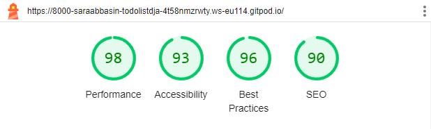

 Todo List 

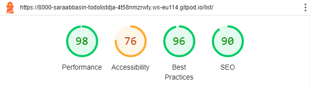

 Create Task 

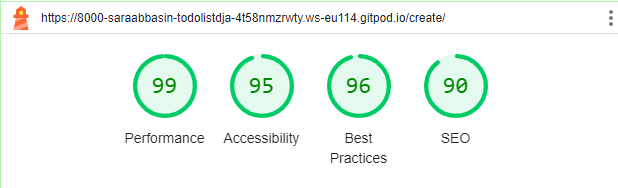

 Edit Task 

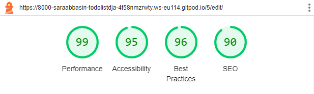

 Delete Task 

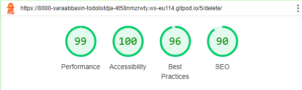

 Logout 

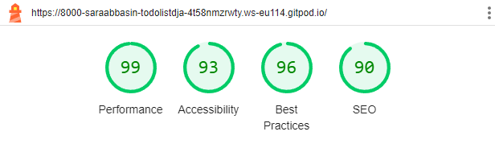

# Known Bugs

## Resolved

I encountered an issue where no options were available to select in the category dropdown when attempting to create a new Todo item.

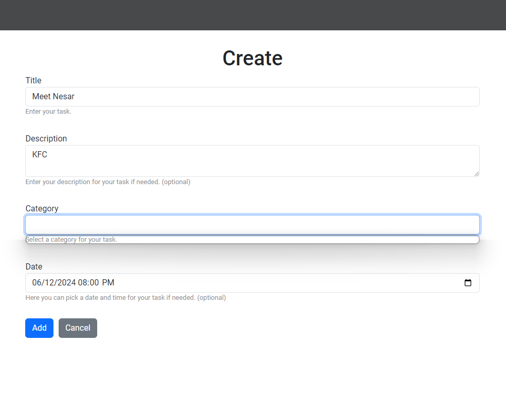

After investigating, I discovered that the issue was due to missing category options in the database. I resolved this by manually adding category options using the Django shell. After adding the options, they became visible and selectable in the form, allowing users to choose a category when creating a Todo item.

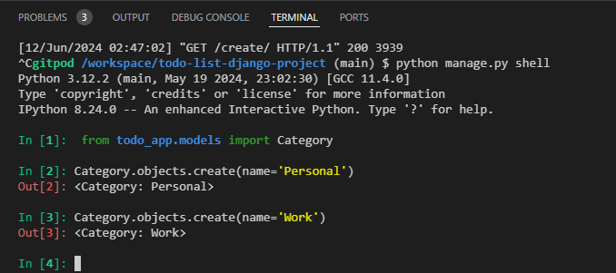

-----------------------------------------------------------------------------------

Encountered difficulty when attempting to host the project on Heroku.

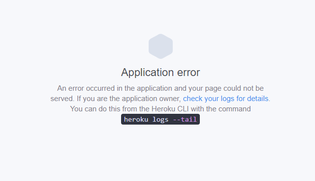

Upon investigating using heroku logs --tail, it was discovered that the issue stemmed from a missing .gitignore file. After identifying this issue, I installed the gitignore package successfully. With the gitignore package installed, the project was hosted on Heroku without any further issues.

## Unresolved 

No known unresolved bugs

Return to [README.md](README.md)

